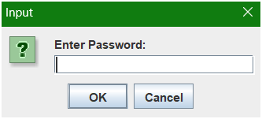
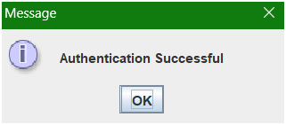
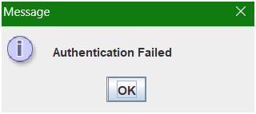
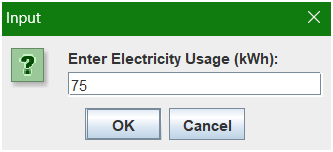
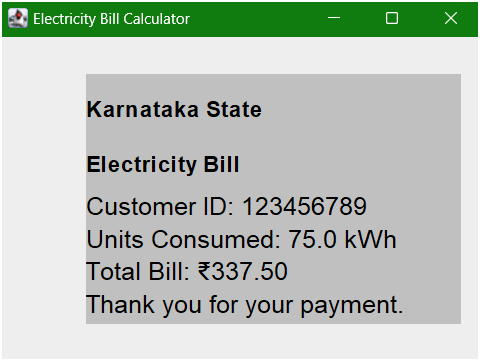

# Electricity Billing System

This is a simple electricity billing system that calculates the electricity bill based on the units consumed by the user. The user is prompted to enter the electricity usage in kilowatt-hours (kWh), and the program calculates the total bill amount based on the following rates:  

- For the first 100 units: ₹4.50 per unit
- For the next 100 units: ₹3.80 per unit
- For the next 100 units: ₹6.00 per unit
- For any additional units: ₹8.00 per unit

The program uses Java Swing to create a simple GUI window to display the bill amount to the user.

## Methadoogy

1. Create a frame for the GUI window.
2. Prompt the user to enter a password for authentication.
3. If the password is correct, prompt the user to enter the electricity usage in kWh.
4. Calculate the total bill amount based on the electricity usage.
5. Display the bill amount in a label on the window.

## Installation

1. Clone the repository
2. Open the project in your favorite IDE
3. Run the `ElectricityBillingSystem.java` file

## Requirements

- Java Development Kit (JDK)
- Integrated Development Environment (IDE) like Eclipse, IntelliJ IDEA,NetBeans or Visual Studio Code
- Java Swing library

# Demo 

1. # Authentication Window

 

2. # Authentication Success

 

3. # Authentication Failure

 

4. # Electricity Usage Window

5. # Bill Amount Window
